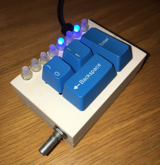

# binkey
A binary USB keyboard

You'll need an Arduino Micro or similar, and a nice solution for the USB cable. I cheated and built my own Atmega32U4 PCB and used a scavenged keyboard cable, but you might want to do it differently.

The original box (binkeybox.scad) is designed for Cherry MX keyswitches, with a "0" and "1" key, a vertical straight 2U Enter key and a horizontal straight 2U Backspace key. PLA works fine for this and you probably don't need very high resolution.

Use eight WS2812D-F5 addressable RGB LEDs with the requisite 75Ω resistors on the data lines and 0.1μF capacitors between Vcc and GND (on each LED), and print 16 collars (LEDring.scad) on a resin printer.

I drilled a 7mm hole for the rotary encoder, and I can't be bothered to add this hole to the design.

The new box (binkeybox2.scad) uses only two Cherry keys, a rotary encoder (on the top of the box this time) and a LED strip like Adafruit's 1426.
Notice that the V2 code is tailored for WGRB LEDs. You may need to change that depending on what you use.

For the keyswitches, I used Kailh's hot-swappable sockets, so it's easy to replace the keyswitches without desoldering.

For the rest: Use The Source, Luke!

Oh, and you can find the key codes and modifier codes under "10 Keyboard/Keypad Page (0x07)" in the HID Usage Tables: https://www.usb.org/sites/default/files/documents/hut1_12v2.pdf
For the modifier codes, there's an Excel file that can be used to print out a little lable to glue to the case.
